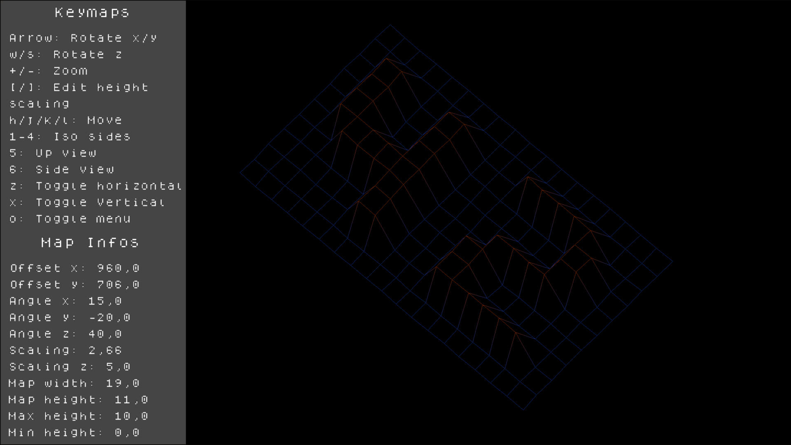
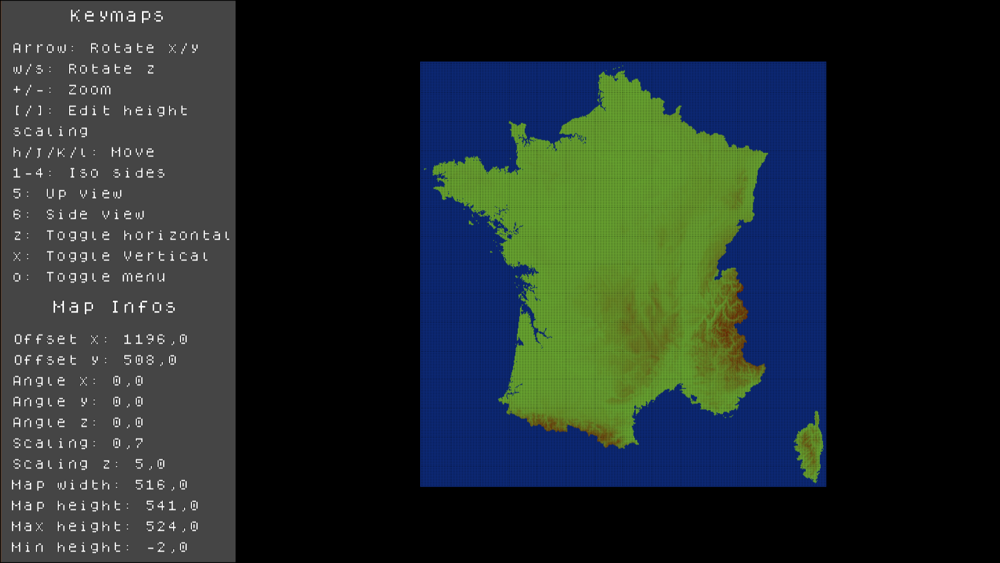
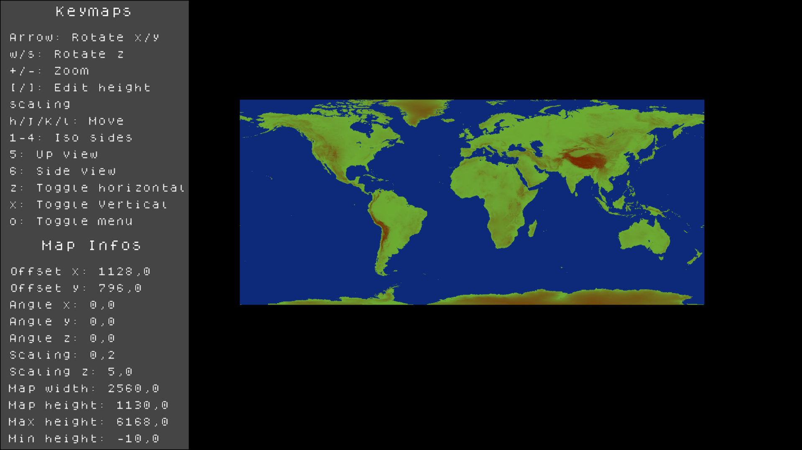
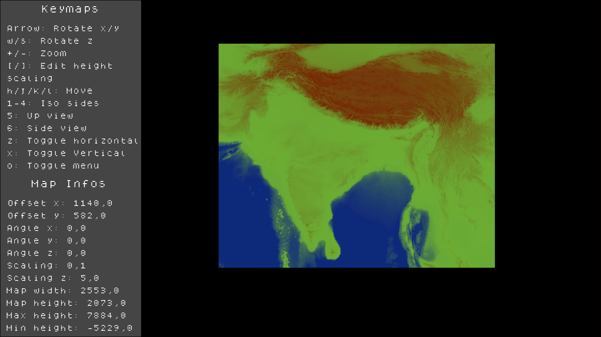

# 🗺️FdF

The objective of FdF is to render a map in isometric projection or in
other projection with a 2D engine.

The given map is format like this:
```txt
0  0  0  0  0  0  0  0  0  0  0  0  0  0  0  0  0  0  0
0  0  0  0  0  0  0  0  0  0  0  0  0  0  0  0  0  0  0
0  0 10 10  0  0 10 10  0  0  0 10 10 10 10 10  0  0  0
0  0 10 10  0  0 10 10  0  0  0  0  0  0  0 10 10  0  0
0  0 10 10  0  0 10 10  0  0  0  0  0  0  0 10 10  0  0
0  0 10 10 10 10 10 10  0  0  0  0 10 10 10 10  0  0  0
0  0  0 10 10 10 10 10  0  0  0 10 10  0  0  0  0  0  0
0  0  0  0  0  0 10 10  0  0  0 10 10  0  0  0  0  0  0
0  0  0  0  0  0 10 10  0  0  0 10 10 10 10 10 10  0  0
0  0  0  0  0  0  0  0  0  0  0  0  0  0  0  0  0  0  0
0  0  0  0  0  0  0  0  0  0  0  0  0  0  0  0  0  0  0
```
The value represent the height of the point and his position in the file represent
the coordinates on the map (on top left it's x=0, y=0).

The map can contain color in rgba after the height like this "10,0x9ABCDEFF".

The render look like this this:

The mandatory part ask us just to render in isometric, it doesn't tell how
the color need to be managed, same for other stuff like scaling, movement, ...

The 2D engine used here is the MacroLibX: [[https://github.com/seekrs/MacroLibX]]

## ✍️My choice

I loved this project so I decided to add other stuff in it to make it more mine:

|Feature|Explaination|
|-------|------------|
|Color management|I handle the color given on the map, and also I create secondary color based on the height (switch with tab)|
|Movement|You can move with the vim's key (H,J,K,L)|
|Scaling|You can zoom in/out with +/-, and also scale the height with \[/\]|
|View preset|Change the view based on preset with number 1-6|
|Rotate|With the arrow you can rotate the map on x and y axis, and with w/s rotate on z axis|

## 🧱Limits

It work with big file even map with 5M of points but the movement and rotation are slow because of
all the math beind to rotate all point, and also because of the line tracing (DDA), but the open remain
instant.

Here some exemple of enormous map files with up view to understand what is it:

(+700Ko)

(+11Mo)

(+22Mo)

## 🧠Learned here

- How to use an external lib and insert it in the Makefile
- Bit shifting with color gradient
- The cost of drawing line and math

